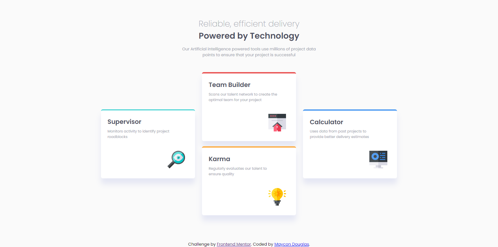
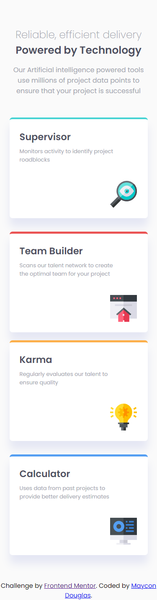

# Frontend Mentor - Four card feature section

## Descrição 

Essa é a minha solução para o desafio [four card feature](https://www.frontendmentor.io/challenges/four-card-feature-section-weK1eFYK), do Frontend Mentor.

[SOLUÇÃO](https://relaxed-galileo-64825d.netlify.app/)

## Feito com:

* HTML  
* CSS

## O que aprendi com esse projeto? 
  
  Particularmente nada novo, porém serviu para consolidar meus conhecimentos em HTML E CSS. Principalmente aqueles relacionados à construção de layouts responsivos e ao correto uso do flexbox.

## SCREENSHOTS

Desktop

Mobile

  

 

